In today's world customer is indeed the king and hence it not only important to retain our royal customers but also to win back the once's who are in the verge or churning out.
Customer segmentation is one method to know who are our loyal customers and who are our one time visitors.
This project is all about how to perform Customer Segmentaion using machine learning.

# Customer-Segmentation
It's a methodology using which we can divide our customer base into group of individuals who are similar in terms of either gender, spending behavior, frequency to visit, age or other demographics. Customer Segmentaion allows companies to precisely target the customers who has a specific needs and desires. This way companies can design the targeted campaigns to the right group or audience. It may also be the case that during the creation of these individual group or clusters company may identify new market segments on which company can focus more as it might be more lucrative, also using segmentation companies can identify groups that require extreme attention such that people in that group are on verge of churning out. 

## About Data
This data set has been retrieved from [kaggle](https://www.kaggle.com/datasets)
This Online Retail II data set contains all the transactions occurring for a UK-based and registered, non-store online retail between 01/12/2009 and 09/12/2011

## Data preparation
As a first step, I load all the modules that will be used in this notebook:
Then, I load the data.

In this we observed that country column has similar values for one particular country so this column is a good candidate to group the customers based on country in order to see the corresponding distribution for different countries.

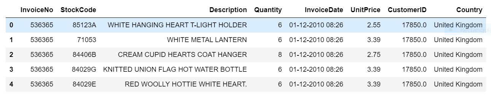

We can see that about 90% of customers are from UK only. So we will keep the data for UK only and rest we will filter out.

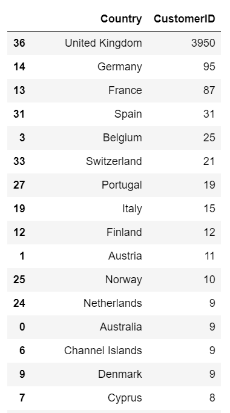

Now we will check for missing value.
Description and customerID has missing values. For now we can ignore missing values of description column  
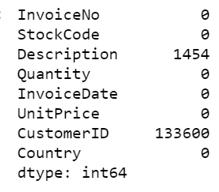

## Data Analysis
This is a graph showing the recency of a customer.
Recency: How recently a customer has made a purchase
The more recently a customer has made a purchase with a company, the more likely he or she will continue to keep the business and brand in mind for subsequent purchases.
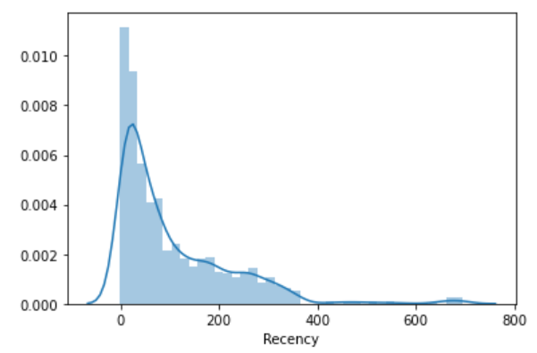

Similar with frequency
Frequency – Frequency score is calculated based on the sum of purchases throughout a customer’s lifetime. Customers who purchase more frequently are more likely to purchase again when compared to customers who have purchased only once, or less frequently.
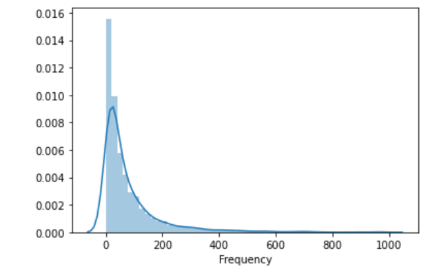

And with Monetary
Monetary – The sum of revenue a customer spends in their lifetime. Customers who have higher total monetary spend are more likely to purchase again in the future when compared to customers who have spent less monetarily.
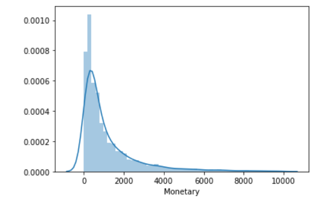

Now, we go through a few overlapping based on their Loyalty Level.
Customers who are grouped inside Platinum are our most loyal customres and in Bronze are the customers who are in the verge of churning out.
Loyalty_level = 'Platinum'> 'Gold' > 'Silver' > 'Bronze'
Between frequency and recency
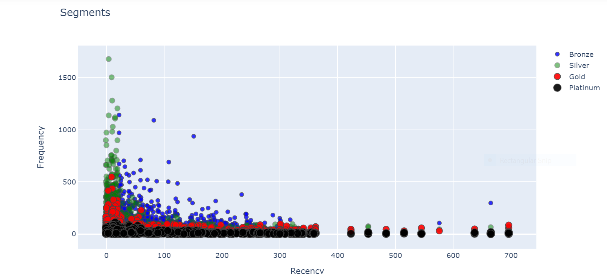

Between monetary and frequency
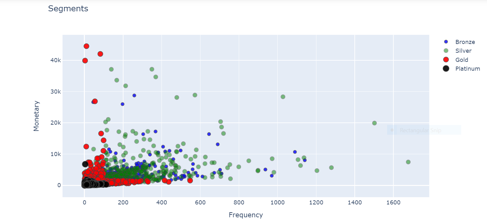

Between monetary and recency
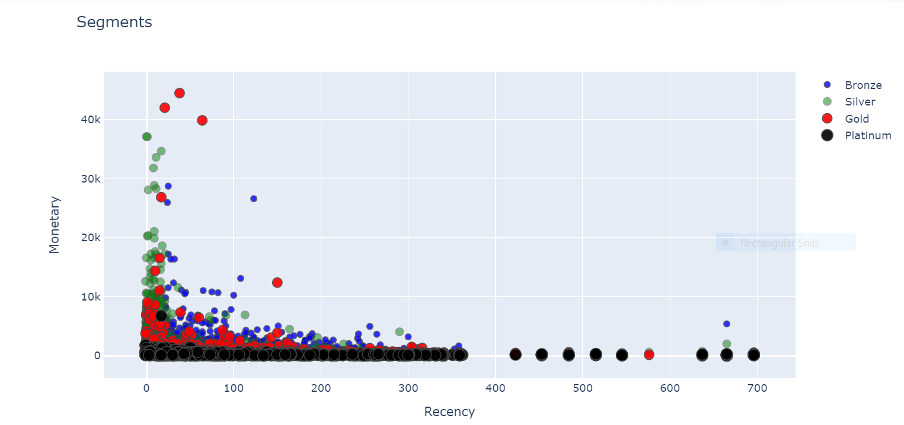

## K-Means Clustering
In order to apply K Means on our dataset, we need to determine optimum number of clusters required. For which, we use the elbow method.
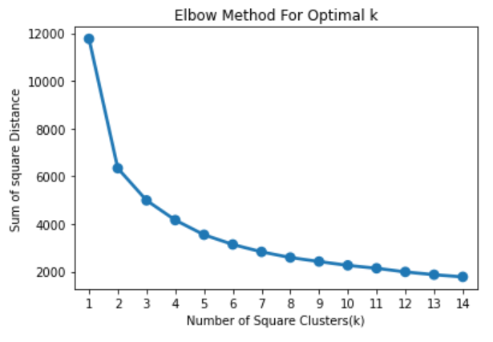
In our case the sum of squared is dramatically decreasing at K = 3 of the elbow of this line, so 3 is the optimal value of k in our case. So number of clusters in this case is three here.

Now we can build our model since we have found number of clusters.
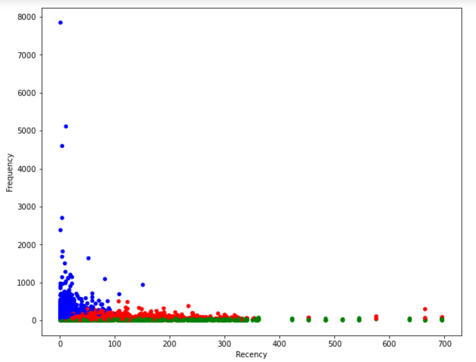

In case of K-Means we have only three clusters red, green and blue as against our RFM modelling we had four clusters of platinum, gold, silver and bronze.
We can infer that in case of k-means out of four clusters two clusters merge together and remaing two left as it is.

 We have successfully created clusters for our customer segmentation data.
## Resources
These are few resources I have used while working on this project
* [Learning Path](https://www.analyticsvidhya.com/learning-path-learn-machine-learning/)
* [Blog](https://towardsdatascience.com/customer-segmentation-with-machine-learning-a0ac8c3d4d84)

THANK YOU!
